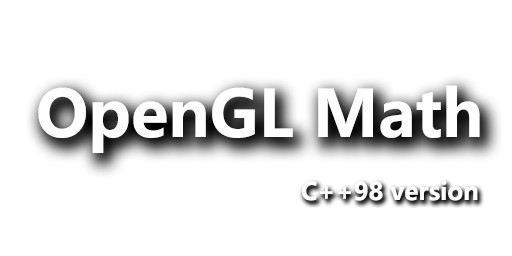

# glm
glm C++98 version.

glm 原库作为图形基础库，下载使用量没有 cglm 多，其中一个原因就是，这个库竟然用 C++ 11。 
这里是一个 C++ 98 版本的 glm 库，兼容比较老的编译器。 
虽然有些方法在实现上，C++ 11 比 C++ 98 方便一些，但也不是不能完全实现。 
好吧，有问题欢迎指正！ 
 
The original GLM library, as the basic graphics library, has not been downloaded as much as cglm. 
One of the reasons is that this library uses C++ 11. 
Here is a C + + 98 version of GLM library, compatible with older compilers. 
Although C + + 11 is more convenient than C + + 98 in the implementation of some methods, it is not completely realized. 
Well, if you have any questions, please correct them! 
 
# 说明 
程序部分，使用的是 C++ 98 标准，所有代码在 cgl::glm 命名空间下。 
glm.hpp 里面使用了 using namespace cgl 来暴露 glm 的命名空间。 
精简了结构，代码量更少，部分代码执行率比原版要快一些。 

# 更新历史 
### 2021-11-20
完成大部分 glsl 函数，指令加速部分，完成矩阵乘法（指令部分，支持 SSE2 内联汇编）。

### 2022-2-15
完善所有基础矩阵类型。(mat2xN ~ mat4xN)
